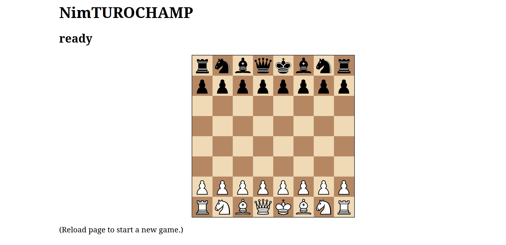

# NimTUROCHAMP

A TUROCHAMP implementation in [Nim](https://nim-lang.org/) which uses the [Sunfish](https://github.com/thomasahle/sunfish) move generator and works as an UCI binary. Based on the [pyturochamp.py](https://github.com/mdoege/PyTuroChamp) code.

Here is a [web browser-based demo](https://mdoege.github.io/nimTUROCHAMP/) of nimTUROCHAMP built with "nim js", with the man himself dishing out some timeless chess advice. (Warning: working sense of humor required!) Use Shift-Reload in your browser (or clear your browser cache) if you are not seeing the latest web app version, which is currently "v19".

## Compilation

    nim c -d:danger --passC:"-flto" ntc

These recommended compilation switches produce a faster engine binary by disabling Nim runtime checks and enabling link-time optimization, respectively.

## UCI parameters

* MAXPLIES: maximum brute-force search depth
* QPLIES: maximum selective search depth

(At the default of MAXPLIES = 2 and QPLIES = 8, there are two brute-force plies and up to six selective plies.)

If you are using the native NTC binary with a GUI chess frontend, make sure that the GUI considers an illegal engine move a resignation, i.e. the GUI should adjudicate a win for the other player in that case. The web app does this automatically.

## License

[GNU GPL v3](https://www.gnu.org/licenses/gpl-3.0.en.html)

